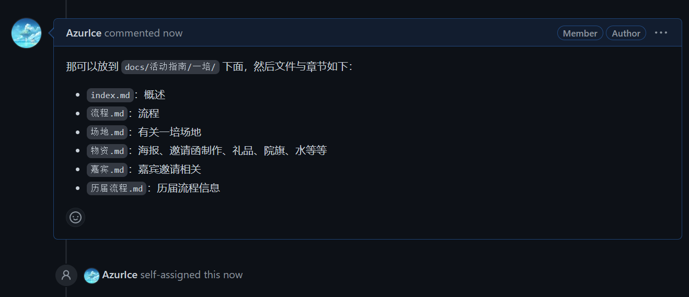

------ WIP（Working In Progress）------

## Wiki 的维护结构

本 Wiki 的维护结构大概如下：

- 文档组（[Document · RuanJianZongHeng Team (github.com)](https://github.com/orgs/RuanJianZongHeng/teams/document)）

  为 Wiki 的主要维护者，可以直接对本仓库进行读写。

- 其他所有人

  都可以对 Wiki 提交 Issue 或 Pull Request。

由于本 Wiki 更偏向于内部使用，且人数较少，所以并没有太严格的规范，不过为了方便还是需要规定一些规则。

## Issue 与 Pull Request 的使用

Issue 主要用于提交「想法」，比如：页面内容有误/过时、希望添加新的页面、希望调整目录/导航结构等

在提交 Issue 时注意添加对应的 label。

Pull Request 则是用于提交「更改」，直接参与到贡献中

注意：不要直接创建 Pull Request，最好先开一个 Issue 描述一下你的想法。

### 例-Issue

例如我认为在 `活动指南` 页面下添加 `一培` 页面，并且 `一培/历届流程` 章节中应当包含历届流程信息，那么我会创建这样一个 Issue：

其他人或许会提出一些看法：

维护者看到之后将进行回应（你也可以 @ 一下），最终得到一个具体的方案，然后将任务分配：

为了防止重复劳动，如果已被分配，就不要再创建 Pull Request 了，耐心等待维护者进行更新，后续在 Issue 中或许也会有进一步的讨论，可以 Subscribe 这个 Issue 以便收到最新的消息：

### 例-Pull Request

比如对于上面的例子，作为 AzurQvQ 的你可能想亲自参与到贡献的过程中去：

那么此时你便可以按照正常的 Git 操作流程创建你自己的分支，维护者可以直接在仓库下创建新的分支，其他人则可以先 fork 到自己这里，再进行更改，这里我直接在线改了：

下面省略一些更改。

然后就可以提交一个 Pull Request了，记得要关联对应的 Issue，关联了以后一旦 PR 被合并，这个 Issue 便会被自动关闭（具体啥是关联查一查 [文档](https://docs.github.com/en/issues/tracking-your-work-with-issues/linking-a-pull-request-to-an-issue)）：

然后耐心等待审查合并，或许维护者会叫你做些更改，就是正常的 Pull Request 流程啦。

---

其他更多有关参与方式以及格式的规范文档目前还未完成，基本就是 Fork 到自己的仓库改完后 Pull Request，如果是 文档组成员便可以直接对仓库进行读写操作。具体标准规范目前可以随意一些，可以简单参考 [如何参与 - OI Wiki](https://oi-wiki.org/intro/htc/) 和 [格式手册](https://oi-wiki.org/intro/format/)。

