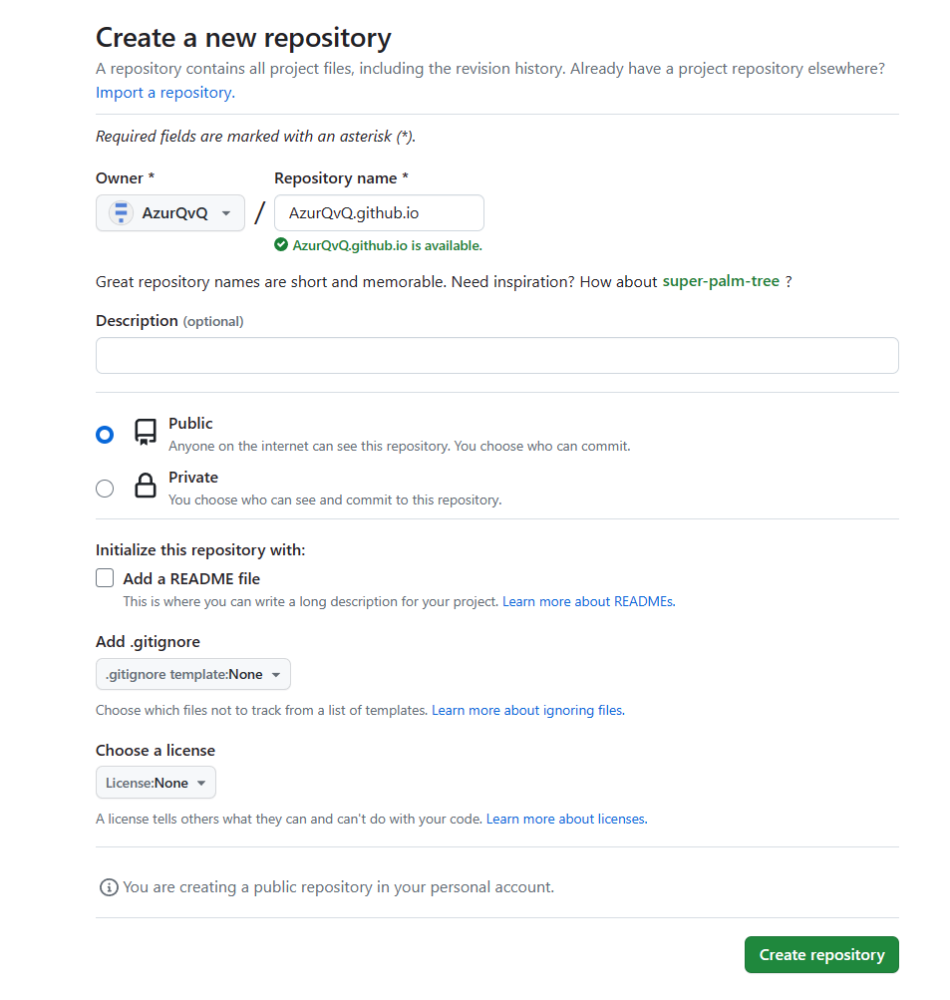
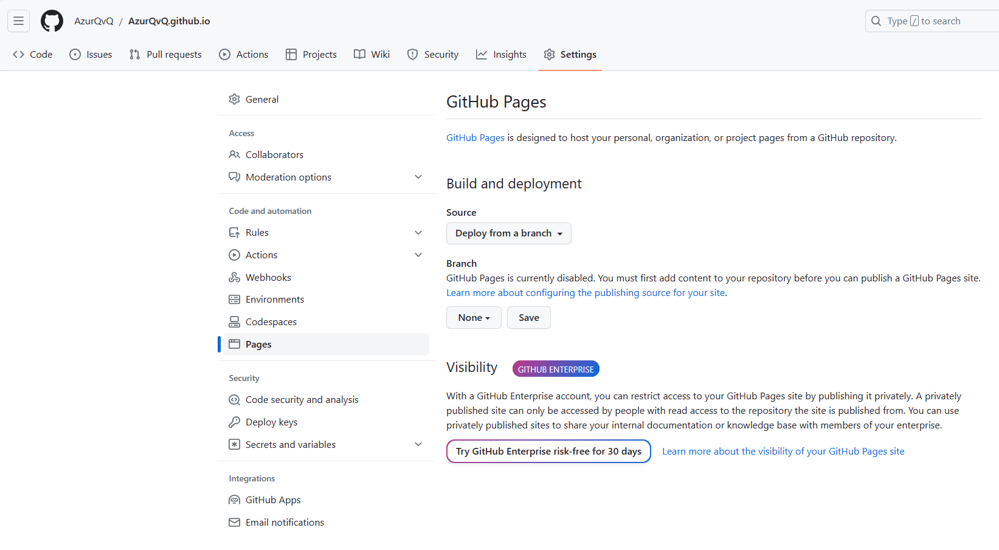
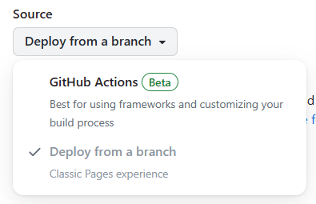
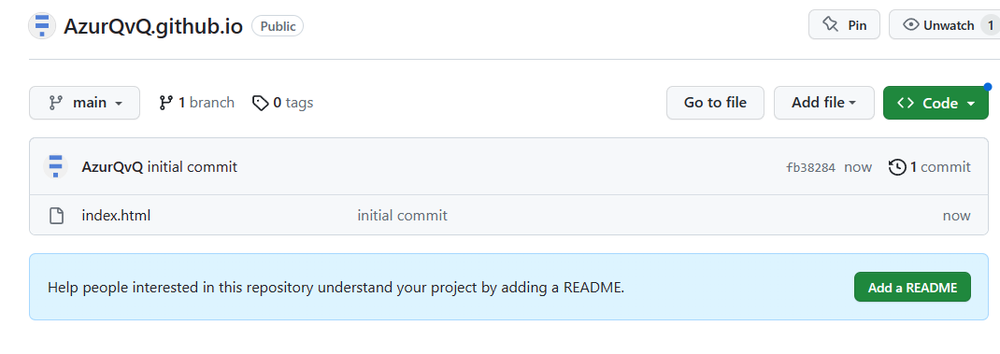
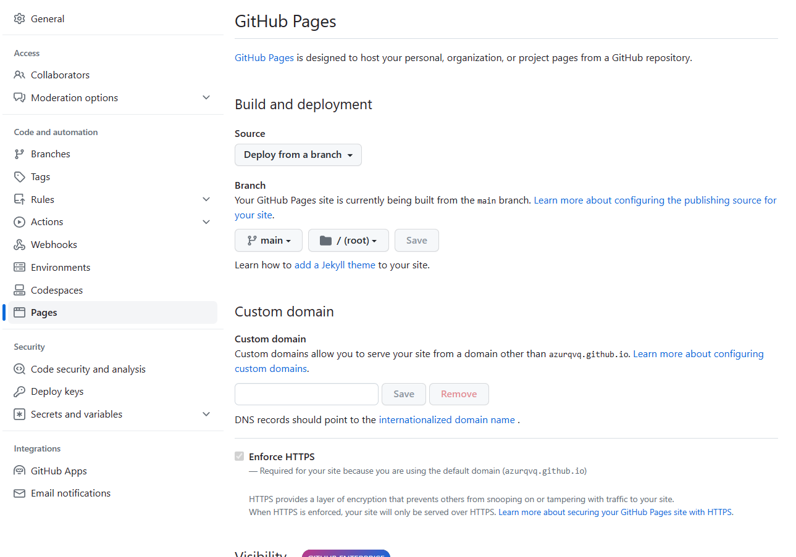
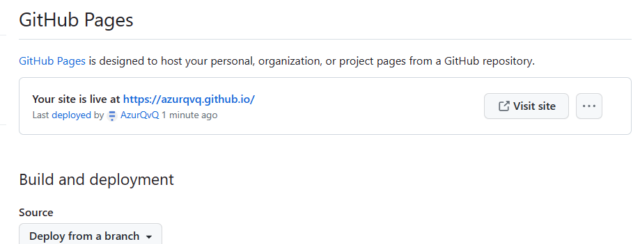
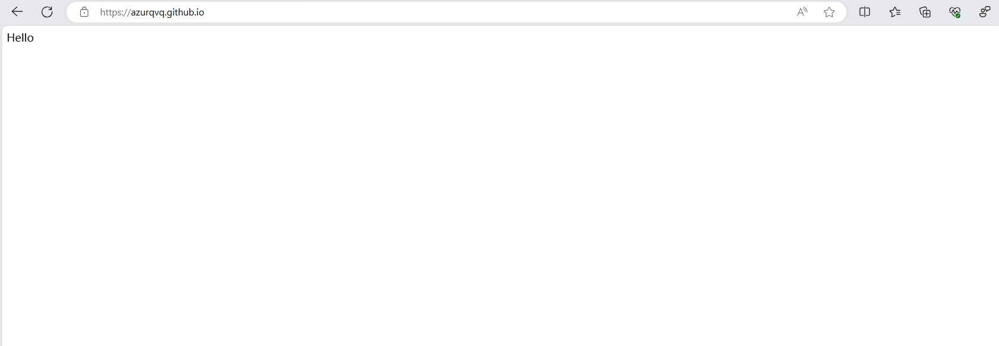
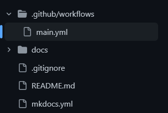
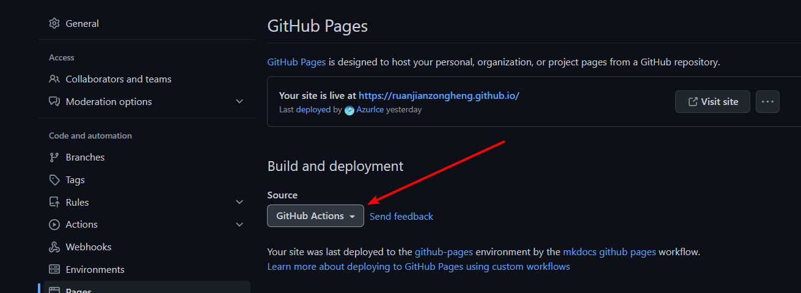

# 技术文档

!!! danger "Working In Progress"
    本页面仍在完善过程中，内容仍不完整

在这里会将一些所要用到的技术做一些整理

一切用到的技术：

1. Markdown
2. Git & Github
3. Mkdocs

---

## 一、Markdown

[GitHub Flavored Markdown Spec | GFM (docschina.org)](https://gfm.docschina.org/)

## 二、MkDocs

> 官网：[MkDocs](https://www.mkdocs.org/)
> Github仓库：[mkdocs/mkdocs: Project documentation with Markdown. (github.com)](https://github.com/mkdocs/mkdocs)

**MkDocs** 是使用 Python 编写的，它能做什么事呢，简单来说就是根据本地的 Markdown 文件构建出网站。

比如，著名的信息竞赛百科 OI Wiki[^1] 就是使用 MkDocs 构建的，其中的每一个页面内容都是使用 Markdown 编写的，加上好看的主题、插件以及相关配置，最终构建出这样的网站。

### 1. 安装

假设你已经安装好了 python。

```terminal
$ pip install mkdocs
```

安装完毕后，便可以使用 mkdocs。

### 2. 基本使用

#### > 创建项目

```terminal
$ mkdocs new my-project
```

这会在当前目录创建一个 `my-project/` 目录，其内容如下：

```
my-project/
 ├─ mkdocs.yml
 └─ docs/
     └─ index.md
```

- `mkdocs.yml` 为 MkDocs 的配置文件
- `docs/` 目录为存放源文档的目录（`docs` 是配置文件中 `docs_dir` 的默认值）

#### > 启动本地服务器

在 `mkdocs.yml` 所在目录下执行 `mkdocs serve` 会运行 MkDocs 内置的开发服务器，当文档或配置文件改变的时候会自动重新加载并生效，可以方便地在本地预览网站效果：

```terminal
$ mkdocs serve
INFO     -  Building documentation...
INFO     -  Cleaning site directory
INFO     -  Documentation built in 0.31 seconds
INFO     -  [14:07:00] Watching paths for changes: 'docs', 'mkdocs.yml'
INFO     -  [14:07:00] Serving on http://127.0.0.1:8000/
```

访问 `http://127.0.0.1:8000/` 来预览页面。

#### > 构建网站

在 `mkdocs.yml` 所在目录下执行 `mkdocs build` 会将整个网站构建成静态文件并输出到 site 目录：

```console
my-project/
 ├─ mkdocs.yml
 ├─ docs
 │   └─ index.md
 └─ site
     ├─ 404.html
     ├─ index.html
     ├─ sitemap.xml
     ├─ sitemap.xml.gz
     ├─ css/
     ├─ fonts/
     ├─ img/
     ├─ js/
     └─ search/
```

> 如果使用 git 来管理项目地话，一般会将这种构建得到的路径加入 `.gitignore` 文件。

### 3. 其他

其他的一些有关配置文件 `mkdocs.yml` 和导航、插件、文档等的内容就不多赘述了，可以查一查文档。

## 三、Git & Github

### 1. Github Codespace

GitHub 有一个功能叫做 Codespace，可以理解为一个网页版的 VSCode，可以在线编辑仓库内容。

使用方式就是将仓库链接中 `github.com` 的 `com` 改为 `dev` 即可，或者使用快捷键 `.`。

### 2. GitHub Pages 与 Github Action

#### > GitHub Pages 简单使用

GitHub Pages 是 Github 的一个功能，可以将一个仓库内的文件托管为一个网站，而且是免费的。

GitHub Pages 的仓库通常有特殊的名称，比如对于一个 **用户** 的网站来说，仓库名会叫做 `<username>.github.io`，而对于一个 **组织** 的网站，仓库名会叫做 `<organization>.github.io`。

> 其中 `<username>` 和 `<organization>` 为 **用户名** 和 **组织名**。

下面我将使用我名为 AzurQvQ 的用户创建一个与此用户关联的 GitHub Pages 仓库。



然后到 Settings -> Pages 中可以看到相关的设置：



这里 Build and deployment 中的 Source 表示使用哪里的文件，有两种：



默认是 Deploy from a branch，顾名思义就是使用某一个分支下的文件作为网站的根目录，而另一个 Github Actions 一会也会讲到。

由于目前仓库是空的，所以无法启用 GitHub Pages，这里我创建了一个 index.html 并提交了上去：



现在再来看就可以看到 GitHub Pages 已经启用了：



等一段时间刷新一下便可以看到：



此时访问 URL 即可访问我们的网站：



不过一般并不会直接使用 main 分支的根目录作为网站的根目录，因为很多时候我们的网站是通过一些框架构建出来的，而非直接编写的。

所以有时候我们会将源代码放在 main 分支，而将构建出的内容传至另一个分支，或者另一个目录，而设那个分支或者目录为网站的根目录。

下面来讲另一种方式 Github Action。

#### > GitHub Pages + GitHub Action

如果将仓库当作数据库的话，那么可以将 Github Action 当作是一个触发器，它可以实现根据配置在每有新的 Commit 提交，又或是新的 Pull Request 被合并等等的时候执行特定的命令。

> 而且，你可以将运行命令的环境当作是一个云服务器，详细见下

GitHub Action 的配置文件被放置于 `.github/workflows` 下，使用 `yaml` 编写，比如这是 软件纵横 Wiki 仓库的 GitHub Actions 配置文件：



```yaml
name: mkdocs github pages

on: # 运行条件
  push: # push
    branches: ["master"]  # 只有 master 发生 push 时运行
  pull_request: # pull_request（没有设置）
  workflow_dispatch: # 这个就是是否能够手动运行，如果启用会在 Actions 中有一个手动运行的按钮

# Sets permissions of the GITHUB_TOKEN to allow deployment to GitHub Pages
permissions:
  contents: read
  pages: write
  id-token: write
  
# Allow one concurrent deployment
concurrency:
  group: "pages"
  cancel-in-progress: true

jobs:
  # 构建
  build:
    runs-on: ubuntu-22.04 # 运行环境
    steps:
      - name: Setup Python
        uses: actions/setup-python@v4.5.0 # 可以使用其他人编写好的 workflow，相当于一个脚本，这个就是安装 python 的
    
      # 运行一些命令（安装依赖）
      - run: pip install mkdocs
      - run: pip install pymdown-extensions
      - run: pip install mkdocs-material
      
      - uses: actions/checkout@v3 # 获取仓库最新文件
        with:
          submodules: true
          fetch-depth: 0

      - name: 🔨 Build Site
        run: mkdocs build # mkdocs 构建命令

      - name: ⏫ Upload GitHub Pages artifact
        uses: actions/upload-pages-artifact@v1.0.7 # 上传构建完毕的文件
        with:
          path: ./site
  # 部署
  deploy:
    runs-on: ubuntu-latest # 运行环境
    needs: build
    environment:
      name: github-pages
      url: ${{ steps.deployment.outputs.page_url }}
    steps:
      - name: ☁️ Deploy GitHub Pages site
        id: deployment
        uses: actions/deploy-pages@v1.2.4 # 部署页面
```

再于设置中选择使用 GitHub Actions 作为 Pages 的源：



### Github 的几种协作方式

首先先来讲一个最简单的方式，这种方式常用于一些体量较小的更改


接下来是一种比较粗暴的方式，就是直接给予其他人权限，直接 push

另外一种就是 fork

再就是第二种加上分支保护规则也就是我们所用的


---

[^1]: https://oi-wiki.org/