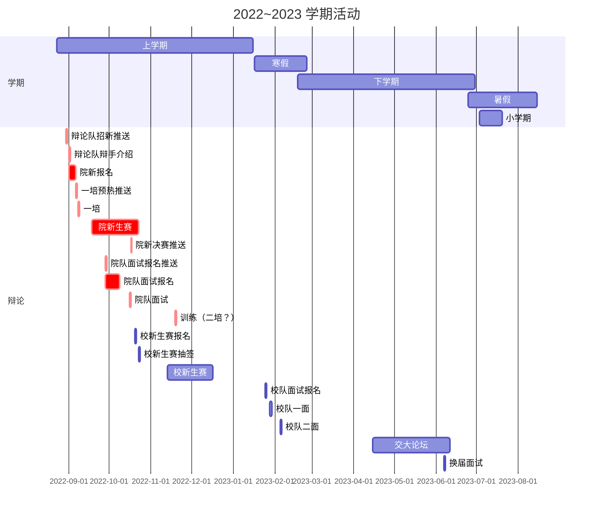
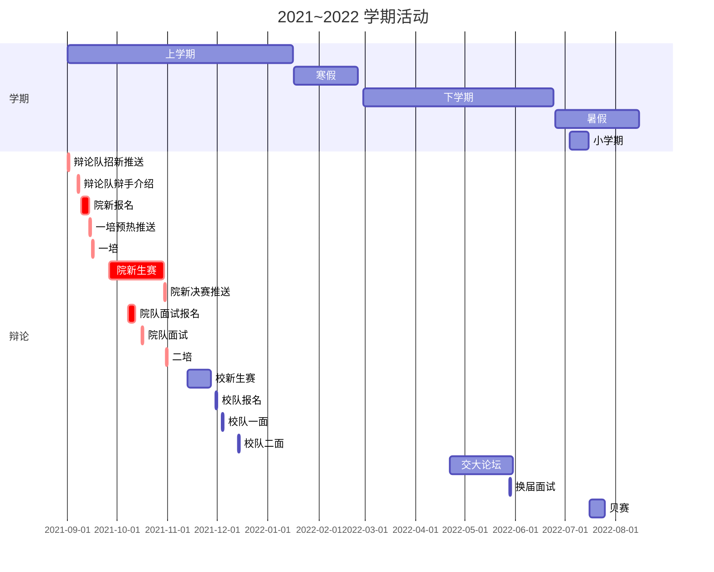

# 概述

!!! danger "Working In Progress"
    本页面仍在完善过程中，内容仍不完整

历年的大致活动时间如下，其中红色的是我们要承办或完成的活动或工作：

> 每年的时间会有所不同，视实际情况（新生课表、是否有突发事件等）而定。

/// tab | 2022~2023

///
/// tab | 2021~2022

///

TODO：活动介绍及筹办指南